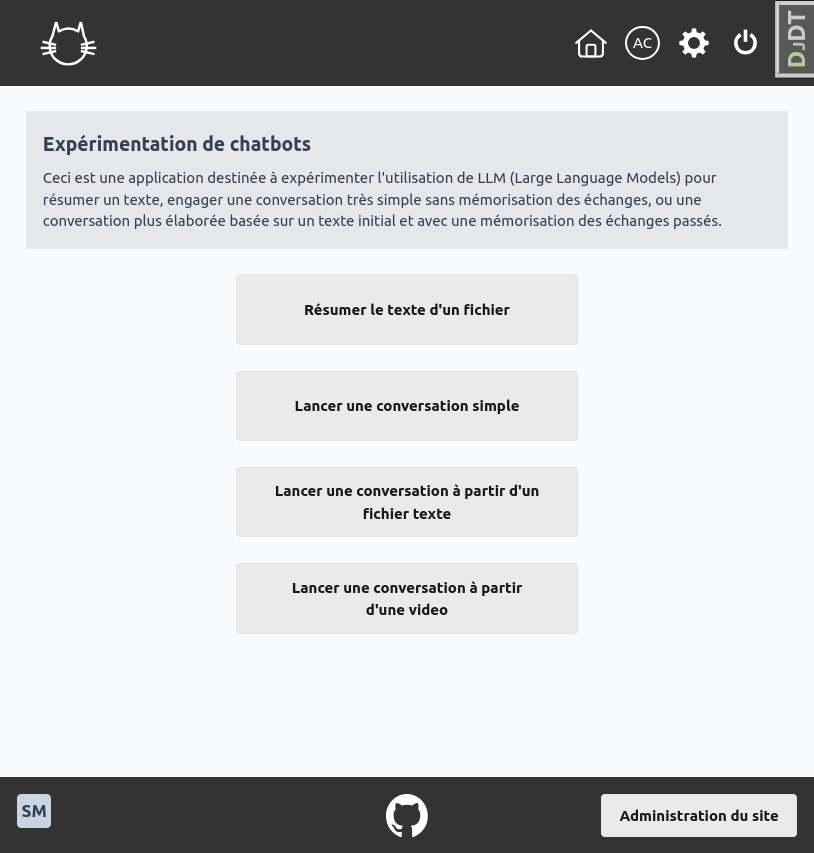
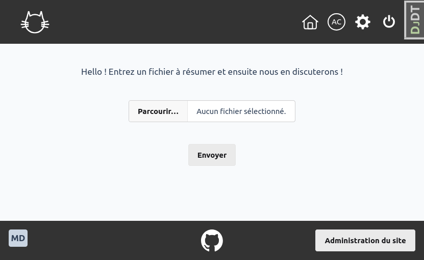
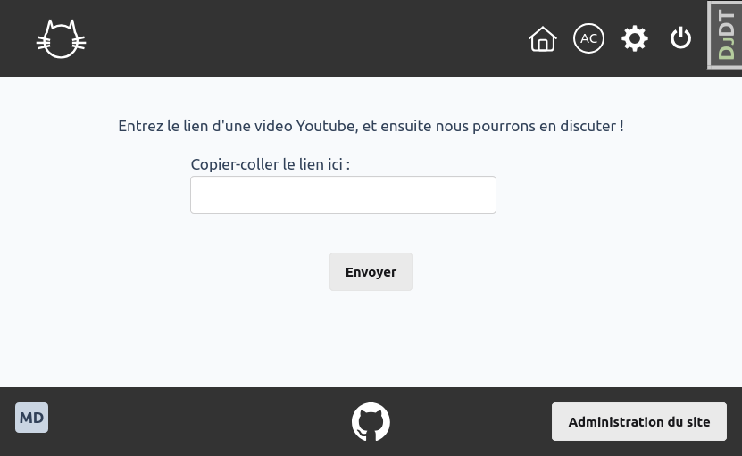
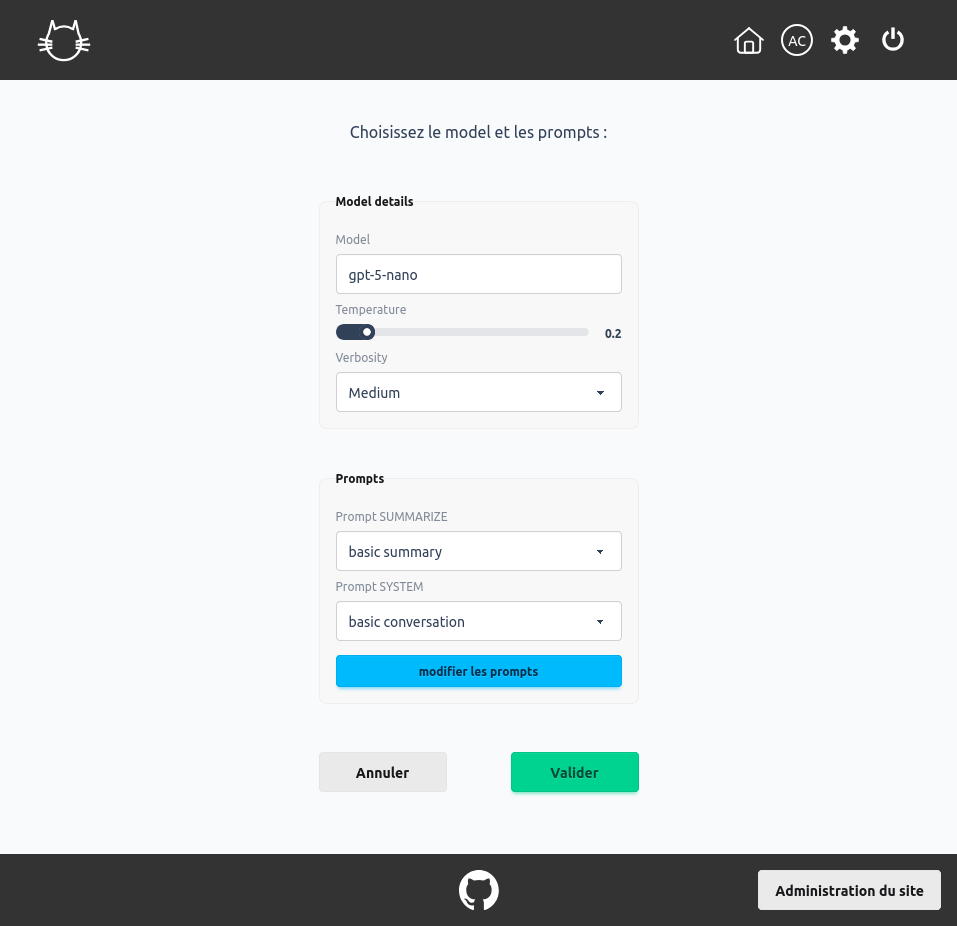
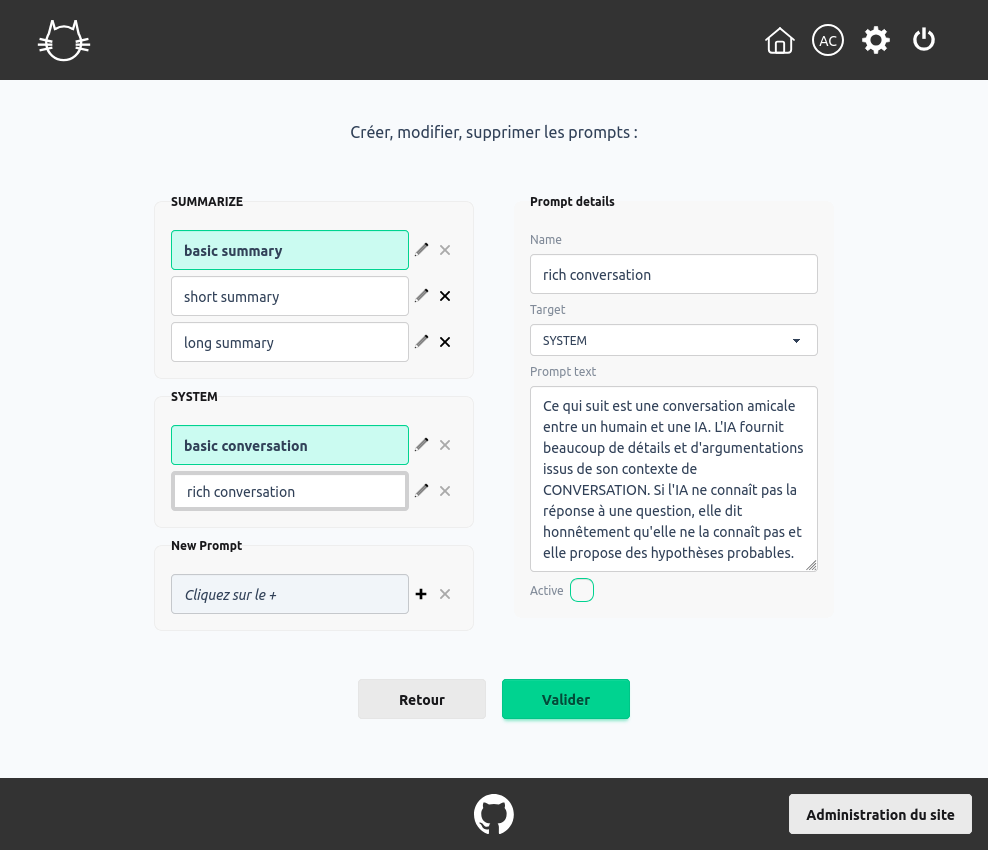

# &#128570; Projet de Chatbot &#128570; 

## &#128203; Généralités :
- python3.12 / django 5.2 
- principales librairies utiisées :
    - langchain, langraph
    - django-rest framework
- API openai pour les LLM
- base de donnée mysql ou postgresql
- auteur : Christophe Vellen


##  &#8205;&#127891; Démonstration : [ici](https://www.chatbot.experientiae.fr/) [accès protégé par mot de passe]


## &#129520; Fonctionnalités :
- accueil :
<p align="center">

</p>

- résumé d'un texte
- conversation simple (sans mémorisation)
- résumé d'un texte + conversation à partir de ce texte (avec mémorisation des échanges)
<p align="center">

</p>

- résumé d'une video youtube + conversation à partir de cette video (avec mémorisation des échanges)
<p align="center">

</p>

- réglages des modèles :
    - choix d'un modèle parmi ceux de l'API openai : platform.openai.com
    - choix de la température (plus ou moins créatif)
    - choix de la verbosité
<p align="center">

</p>

- réglage des prompts système :
    - modification et enregistrement des prompts pour le résumé
    - modification et enregistrement des prompts système
<p align="center">

</p>


## &#128736; Installation : 

- installer pyenv, poetry et python3 v3.12 :
```bash
    curl https://pyenv.run | bash
    curl -sSL https://install.python-poetry.org | python3
    pyenv local 3.12.10
```

- cloner le projet :
```bash
    git clone https://github.com/C-Vellen/Chatbot.git
```
- créer une base de donnée Mysql ou Postgresql

- en développement, créer et paramétrer settings/develop.py (voir develop.example.py)
    ``` 
- en production, créer et paramétrer settings/production.py (voir production.example.py)
- définir en variable d'environnement les paramètres de la base de données (voir .env.example)
- installer les dépendances, définies dans le fichier **pyproject.toml** :
    ```bash
        poetry install
    ```

- activer l'environnement virtuel:
    sur console du serveur, à la racine du projet:
    ```bash 
        source .venv/bin/activate
    ```
    - première migration de la base de donnée :
    ```bash
        ./src/manage.py migrate
    ```
    - création du superuser (administrateur):
    ```bash
        ./src/manage.py createsuperuser
    ```
    - pré-remplissage de la base de données (valeurs par défaut dans dossiers fixtures/):
    ```bash
        ./src/manage.py loaddata home.json tuning.json
    ```
    - initialisation tailwind :
    ```bash
        ./src/manage.py tailwind install
        ./src/manage.py tailwind build
    ```

    - collecte des fichiers statiques (en production) :
    ```bash
        ./src/manage.py collectstatic
    ```

    - lancer le serveur (voir ci-dessous), se connecter en tant qu'administrateur et aller sur l'administration django
        - modifier le user : entrer subId (random), nom, prénom, group (auteur, gestionnaire, admin)        
        - compléter les champs image et fichier des tables home/libelles et home/defaultcontent

## &#128640; Lancement du serveur de développement :

    ```bash
        source .venv/bin/activate
        ./src/manage.py tailwind dev
    ```


